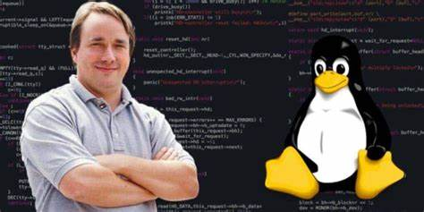

# INICIANDO CON GIT 🥵
_____
## Primera clase
### 1.- Definicion
Para iniciar con git, debemos de tener en claro lo que es un **controlador de versiones. Un controlador de versiones es un sistema que va registrando los cambios que realizamos en el codigo de un proyecto, nos deja ver el historico de todos los cambios realizado, saber quien lo hizo y cuando, entre muchas otras opciones.

He de suponer que se preguntaran sobre la importancia de git o cualquier controlador de versiones al momento de realizar un proyecto, o por que actualmente tiene tanto impacto. 🤔 Git al igual que su competencia, nos ayuda en el rendimiento al momento de programar, ya sea de forma solitaria o grupal, ya que registra y guarda solamente lo necesario y vital, asi mismo, conserva toda accion realizada, (si eliminaste un parrafo o linea de codigo, si cambiaste ciertas variables, etc.) se encarga de almacenar esos datos y en otras palabras, crear una copia de seguridad, con el uso de ciertos comandos.
### 2.- Historia
 Git fue creado por Linus Torvalds, el mismo creador del kernel de Linux. Surgió en 2005 como una solución a los problemas que enfrentaba el equipo de desarrollo de Linux al tratar de coordinar y gestionar las diferentes versiones del kernel de manera eficiente.

Antes de Git, el equipo utilizaba un sistema de control de versiones llamado BitKeeper, pero surgieron disputas con la empresa detrás de BitKeeper, lo que llevó a Torvalds a desarrollar su propio sistema. Git se diseñó con un enfoque descentralizado y distribuido, lo que significa que cada usuario tiene una copia completa del historial del proyecto, lo que lo hace robusto y adecuado para proyectos de código abierto y colaborativos. Desde su creación, Git ha crecido enormemente en popularidad y se ha convertido en el estándar de facto para el control de versiones en la industria del desarrollo de software. - ChatGPT (2024)

Este conchesumare, asi como lo ven, al ponerle el Bitkeeper de paga, en lugar de buscar otra opcion, decidio aplicar la de:

Entrando a otro punto fundamental de git, veremos que son los repositorios. 

### 3.- Repositorios
Podemos ver a los repositorios como unas carpetas con esteroides xD, ya que guarda los archivos respectivamente, junto a sus cambios e historicos realizados dentro el proyecto.

Psdt. No lo digo yo, asi lo ve la IA xD.

## Algunos comandos de Git
### COMANDO: git init 
Antes de ver que es lo que hace el comando en si, es importante recalcar que el git es vital al momento de realizar operaciones, es nuestro "padre nuestro" dirian xD. El comando git init es el que inicia el proyecto, el que marca un directorio y lo convierte en un repositorio. Lo puedes seleccionar dandole la direccion del directorio (direccion/del/directorio) o haciendo cd hasta llegar a la carpeta deseada. 
### COMANDO: git add
Con git add, le das a entender a git que quieres agregar actualizaciones o cambios realizados en un archivo o directorio concreto al realizar la proxima confirmacion con el comando que veremos a continuacion.
### COMANDO: git commit y sus variaciones
Podemos ver el git commit como el punto de guardado de un videojuego.

 En otras palabras, es el comando que registra los cambios realizados, asi mismo, este tiene 3 variaciones distintas:

- git commit <archivo>
  
   Que solo se encarga de guardar los cambios.
- git commit -m <descripcion del cambio> 
  
  Con el *-m* guardamos el cambio realizado, y agregamos una descripcion de los cambios que realizamos
- git commit <archivo> -m <descripcion>
  
  Con este comando podemos seleccionar un archivo en especifico para poder guardar los cambios, y asi mismo agregarle una descripcion corta.
### COMANDO git status:
  Con este comandito insano veremos cual es el estado actual de la rama en la que estemos.
  
  Como pueden observar en el ejemplo, podemos ver que necesitamos hacer un commit y un add a ciertos archivos, es de vital importancia revisar constantemente el estado de nuestro codigo, verificar que todos los cambios hayan sido guardados con un commit.
  ### COMANDO: git log
El comando git log nos permite observar el historico de la rama en la que estamos trabajando, todos los commits que hicimos, que, cuando, quien lo ghizo y su ID, que nos permite diferenciar un commit de otro. Este, al igual que otros, tiene sus variaciones que nos ayudan en casos especificos.

   - git log --oneline

  Que nos permite ver los commits realizados en una sola linea, junto a su ID.
  

   - git log --graph
  
  Nos deja ver todas las ramas (branch) que tenemos en un proyecto. Y al igual que el git log, nos permite ver el autor, la fecha y los commits que hicimos.

  Ahora, tambien tenemos un comando que fusiona los 2 vistos anteriormente, entonces nos permitiria ver todas las ramas en el proyecto de forma mas simple.
   - git log --graph --oneline

### CONFIGURACION INICIAL DE GIT:
  Antes de realizar todo esto, necesitas configurar tu nombre y tu correo en lo que es el git, para que al realizar un cambio o un commit y lo subas al servicio en la nube (github) se pueda identificar quien realizo esos cambios. Los 2 comandos primordiales que debes ejecutar son:

  - git config --global user.name <tu nombre>
  - git config --global user.email <tu email>
  
  Una vez ejecutemos estos comandos, estaremos listos para comenzar a trabajar con Git y Github.😉

____
  ## Segunda clase 
  ### 1.- Ramas y conflictos
### 1.1.- Ramas
  Para saber que es una rama en especifico, debemos de comprender la forma en la que debemos verla, ya que asumirla como la rama de un arbol es erroneo, ya que estas se dividen pero ya no vuelven a la gitrama principal, en su lugar debemos verlo como una autopista, que se va dividiendo en calles, pero que al final terminaran nuevamente en la autopista. En otros terminos "Una rama en Git es simplemente un apuntador móvil que señala a una confirmación específica en la historia del repositorio."
  Al crear una rama y guardarla con un commit, generamos una bifurcacion de la rama principal (main), usando la analogia de la autopista, creamos una nueva calle que sale de la avenida.
  Pero...En que nos beneficia el uso de estas dichosas ramas?  
  Pues son utiles para un trabajo remoto...un trabajo en paralelo, donde un grupo de personas pueden trabajar sobre un proyecto al mismo tiempo. Y aqui entra el otro punto, que permite un desarrollo no lineal, en otras palabras que no afecta al proyecto principal o a la rama (main). Aclarar que el nombre de una rama debe especificar lo que se esta haciendo en esa rama (Si haces un login o un history, debes nombrar a la rama de la misma manera.)
  
 ## Algunos comandos de las ramas

-  git branch
  
  Con este comando en bruto, vemos todas las ramas existentes en el proyecto que tengamos.

-  *git branch <archivo>*

    Agregar un archivo al comando git branch nos permite crear una bifurcacion en la rama en la que nos encontremos, en otras palabras, creamos una rama a partir de la rama en la que nos encontremos
-  *git switch <archivo>*

  Con git switch podemos movernos de rama en rama, no sin antes haber realizado un commit. Basta con escribir un git switch main (ejemplo) para movernos de la rama en la que nos encontremos a la rama principal main. 

**COMO YA MENCIONE, ES IMPORTANTE REALIZAR UN COMMIT EN TODO MOMENTO, AL MENOS ANTES DE INICIAR O CREAR UNA RAMA, PUESTO QUE, COMO CREAMOS UNA RAMA SI NO TENEMOS UN TRONCO ESTABLE?**
- *git switch -c <archivo>*

  Esta variacion nos permite crear una rama y darle un nombre, a partir de la rama en la que nos encontremos.
-  git checkout, el comando que hacia muchas cosas.

  git checkout cumplia las funciones de 2 comandos que ya vimos anteriormente git switch y git restore, este comando se divide ya que se debate sobre si realmente cumple y entra dentro de la ideologia Unix, donde se cuestionaba si la accion que realizaba la hacia bien, (larga historia xD). en este caso, el comando similar a *git switch-c <archivo>* seria *git checkout -b <archivo>*
  ### Fusionar ramas
- git merge <rama>
 
   Este comando es el que nos permite cargar una rama a la rama en la que estemos, es de los comandos mas importantes, ya que se encargara de traer alguna correccion o parche que hayamos realizado en otra rama.
   ### Eliminar ramas 
- git branch -d
  
  Podemos llamar a esta forma de eliminar una rama. como una eliminacion "suave", ya que antes de ejecutarla, siempre verificara si ya realizamos un merge con otra rama o directamente con la rama main en caso de que no fuera asi, no nos permitiria eliminarla.

 - git branch -D
  
   Si el comando anterior era "suave" este comando es mas agresivo, puesto que no te consulta ni verifica nada, elimina el archivo directamente.
 
Ahora, una duda que pueden llegar a tener es, pongamos un ejemplo; tengo una rama login y creo una rama fix_login a partir del commit de esta, y elimino la rama login porque ya no me es necesaria, la rama fix_login que creamos a partir de login tambien se eliminaria? Veamoslo graficamente.
  

   Visto graficamente, podemos suponer que la rama fix_login se encuentra en el aire, sin ningun punto de sosten, pero el error se encuentra ahi, ya que git no funciona de esa manera, ya que la rama login no supone un punto de apoyo para fix_login. Entonces, no debemos guiarnos solamente en lo que vemos, puesto que git no se trata de un sistema que se base en suposiciones, precisa exactitud para cumplir todas las tareas que nosotros le demos, ya que tanto git como el computador, no tienen conciencia propia.
  ### Fast forward o avance rapido
  Un fast forward se trata de un comando de fusion que no precisa crear un nuevo commit, dicho en otras palabras, imagina que estás leyendo un libro y tienes dos marcadores. Si ambos están en la misma página, simplemente puedes mover uno para que estén juntos. En Git seria un "avance rápido". No hay necesidad de agregar otro commit sobre dónde se encontraron.

Para fusionar 2 ramas de manera "rapida" no es necesario incluir el fast forward en el comando, ya que esto se sobreentiende con el merge, en cambio, si no quieres usar el fast forward, necesitas incluir --no-ff al momento de hacer merge en una rama.
  - git merge --no-ff <rama>
  
 _____
  ## 3ra clase
  ### Github como repositorio remoto

### 1.1 Definicion
  Github es un servicio en la nube que es popular por facilitar el trabajo en equipo al momento de programar mediante el uso de git como controlador de versiones, es de vital importancia al momento de trabajar en proyectos grandes, haciendo incapie en las empresas, ya que como mencione anteriormente, nos permite guardar, descargar, colaborar y gestionar proyectos en conjunto a otras personas.
  ### 1.2 Historia
  GitHub fue fundado en 2008 por Tom Preston-Werner, Chris Wanstrath y PJ Hyett. Su objetivo inicial era proporcionar una plataforma de alojamiento de repositorios de código que utilizara el sistema de control de versiones Git de manera eficiente. La plataforma ganó popularidad rápidamente debido a su interfaz fácil de usar, su enfoque en la colaboración y sus características sociales. ChatGPT-2024

  Desde mi punto de vista profundizar mucho en la historia no es importante, basta con saber las intenciones que tenian sus creadores y sus ventajas. 
  ### COMANDO: git remote
  Listo, ya vimos lo que son repositorios locales y como trabajar con git, ahora, como subo mi proyecto a github? Es relativamente facil si sabes lo que haces xD, antes de hacer cualquier cosa, debes tener un lugar en github al que puedas mover o pasar tu repositorio local (algo obvio no? xD) Para esto crearemos un repositorio en github, dependiendo del proyecto que tengamos que subir, iremos dandole los parametros necesarios, podemos usar el siguiente link https://repo.new/. que nos llevara a la siguiente ventana:

  
 Y es asi. como creamos un repo en github. :D
Ahora, teniendo ya un repositorio remoto en github, fusionaremos nuestro repositorio local con el remoto que acabamos de crear, y para esto usaremos el comando: 
- git remote add origin SSH direction
- 
  La direccion SSH, se obtiene directamente del repositorio remoto, al presionar en code 

 para luego ir a SSH, donde podemos copiar el codigo SSH y usarlo en este comando.
Nos tendria que salir algo similar a esto git@github.com:midudev/my-awesome-new-repo.git, donde todo en conjunto nos quedaria de la siguiente manera 
- git remote add origin git@github.com:midudev/my-awesome-new-repo.git
  El origin supone un alias que es algo que veremos mas adelante.

  Para saber que repositorios remotos tiene enlazados nuestro repositorio local, podemos ejecutar el comando:
  - *git remote -v*
  Que nos devolvera todas los repositorios que tenemos en nuestro repo local y en nuestro repo remoto.

---
  ### 4ta Clase
  ## Gith push y git pull
  Podemos tener una idea de estos comandos con solo verlos, la traduccion directa de push y pull seria empujar y jalar, aplicando esto a git, podemos ver el push como una manera de subir los cambios que realicemos en un repositorio local a un repositorio remoto. el comando como tal seria
  - *git push* origin rama
  ### Variantes del comando git push
  - git push -all *Que pushea todas las ramas del repositorio.*
  - git push -f *Forzamos el git push*
  Y se preguntaran, en que casos forzamos un git push? Es peligroso aplicar un -f en este comando, ya que reescribira totalmente la rama a la que estemos pusheando, es util en casos como que el proyecto presenta conflictos innecesarios, quiza los cambios importantes se encuentren en la rama que quieras pushear, en ese caso aplicas un -f y te ahorras un buen tiempo.
  - git push -d origin rama *Con este comando, podemos eliminar una rama que se encuentre en el repositorio remoto*
  - git push -u origin rama El -u que aplicamos, podemos verlo como:
  
Ya que el -u, selecciona esa rama como predeterminada para realizar todos los push y pull que hagamos

- git pull rama
  El comando git pull, jala la rama del repositorio remoto hasta nuestra repo local, lo cual nos sirve para continuar el codigo de alguien con quien estemos trabajando, o usar el codigo de alguien como base.

  ### Buenas practicas en git
  Las buenas practicas, son un sistema de consejos o recomendaciones que se deben seguir para que el proyecto sea correcto y limpio, entre las buenas practicas que podemos realizar, encontramos el uso de prefijos para cada commit, especificando que es lo que estamos haciendo en ese commit (fix, patch, add, etc.), evitar el uso de punto final o puntos suspensivos al realizar un commit, ser conciente y escribir detalladamente cada cambio que realices, entre otras.
